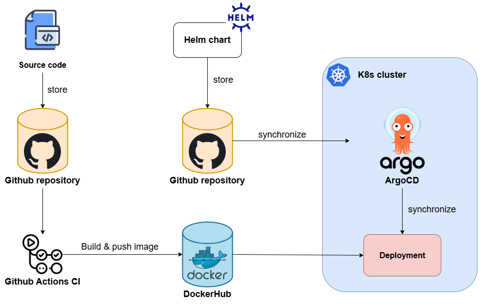
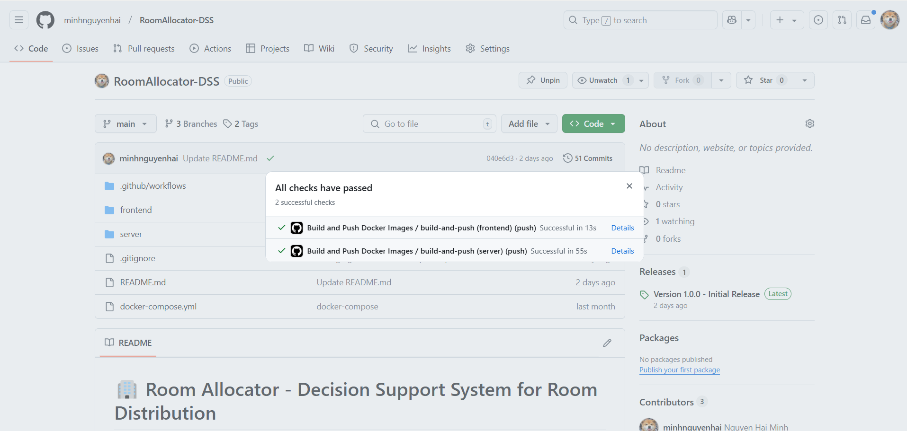
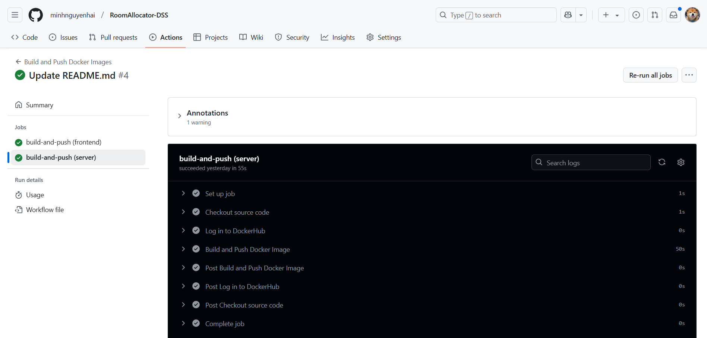
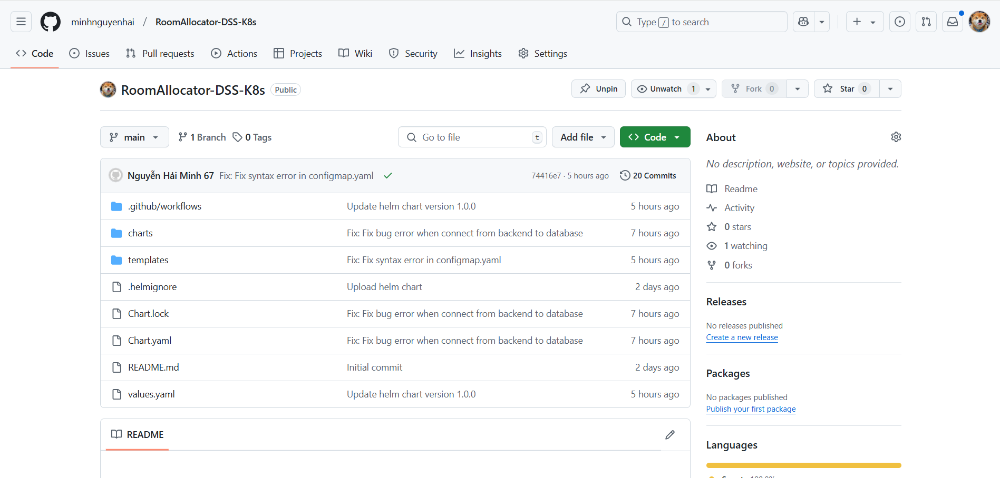
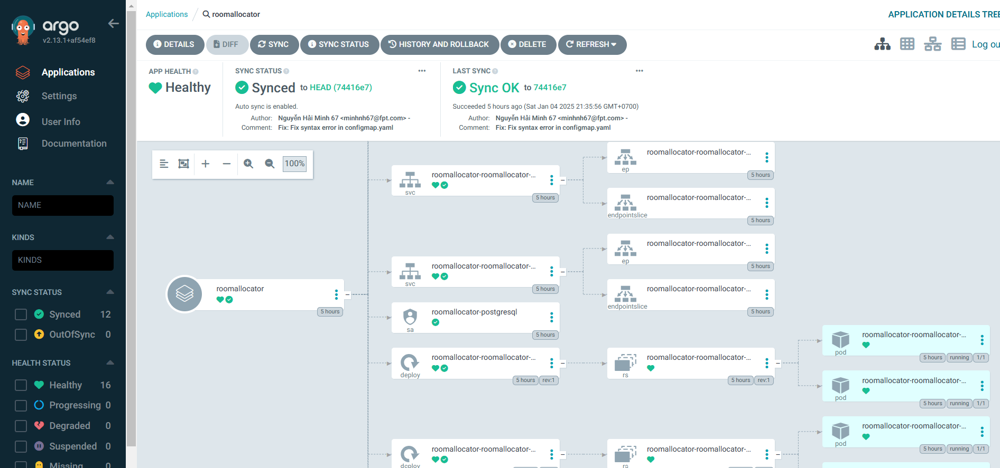
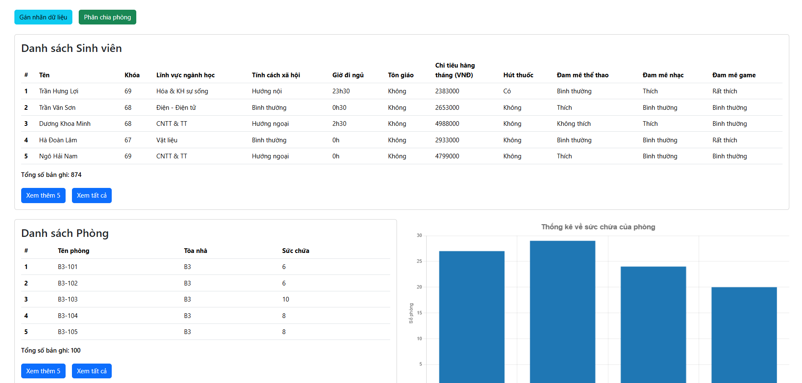

# 🚀 Room Allocator Deployment with CI/CD and Helm Chart

This repository demonstrates the deployment of the **Room Allocator** application, a Decision Support System (DSS) designed to assist dormitory management in efficiently allocating rooms, using modern DevOps practices including containerization, CI/CD pipelines, Kubernetes, and Helm.

---

## 🌐 CI/CD Workflow for Kubernetes Deployment

This repository leverages a comprehensive CI/CD workflow for deploying the **Room Allocator** application to a Kubernetes cluster. The diagram below illustrates the CI/CD pipeline:

### 🔄 Workflow Description:
1. **📝 Source Code**:
   - The source code for the frontend, backend resides in a GitHub repository.
   - Changes are committed and pushed to trigger the pipeline.
   

2. **⚙️ GitHub Actions (CI)**:
   - On every push to the main branch, GitHub Actions build Docker images for the frontend and backend.
   - The images are pushed to **DockerHub**.
   
   

3. **🐳 DockerHub**:
   - Acts as the image registry for storing Docker images used in Kubernetes deployments.
   

4. **📦 Helm Chart**:
   - A Helm chart for the Room Allocator application resides in another GitHub repository to manage Kubernetes resources.
   

5. **☸️ Kubernetes Deployment**:
   - **Argo CD** synchronizes the Helm chart from the repository and deploys the application to the Kubernetes cluster.
   

---

## 🏠 Room Allocator Helm Chart

This repository includes a Helm chart for deploying the Room Allocator application, which consists of:
- **🖥️ Frontend**: A user-friendly web interface for supporting to allocate dormitory rooms for students.
- **⚙️ Backend**: The core logic that implements decision-making algorithms and interacts with the database.
- **📊 PostgreSQL**: A database subchart to manage persistent data storage.

### ✨ Features:
### ✨ Features:
- **📦 Containerization**:
  - Frontend and backend are containerized using Docker.
  - The PostgreSQL database is deployed as a subchart for easy integration.

- **📈 Scalability**:
  - Replica counts for frontend and backend services can be configured to handle varying loads.

- **☸️ Kubernetes Native Deployment**:
  - Helm charts streamline the deployment of Room Allocator in Kubernetes.
  - Resource limits, service types, and storage configurations are easily adjustable.

- **🔄 Argo CD Integration**:
  - Supports GitOps-based continuous delivery for seamless updates and version control.

- **🤝 Decision Support**:
  - Provides tools and analytics to help dormitory managers allocate rooms effectively.

---

## 📖 Usage Instructions

### Prerequisites:
- ☸️ A Kubernetes cluster (e.g., Minikube).
- 🐙 Argo CD installed and configured in your cluster.

### Steps:
1. **🔗 Add the Helm Chart Repository to Argo CD**:
   - Navigate to the Argo CD UI and add a new Git repository containing this Helm chart.
   - Set the repository URL to the GitHub repository hosting this Helm chart.

2. **📦 Deploy the Application with Argo CD**:
   - Create a new application in Argo CD.
   - Specify:
     - **Source**: The GitHub repository and branch containing the Helm chart.
     - **Path**: The directory where the Helm chart is located.
     - **Destination**: Kubernetes cluster and namespace for deployment.

3. **📊 Monitor Deployment**:
   - Use the Argo CD UI to monitor the deployment process.
   - Verify the application status and resource synchronization.

4. **🌐 Access the Application**:
   - If using service type LoadBalancer for frontend, access the application at exposed external IP.
   - If not using service type LoadBalancer, port forward service for frontend and backend to access.
   
   
