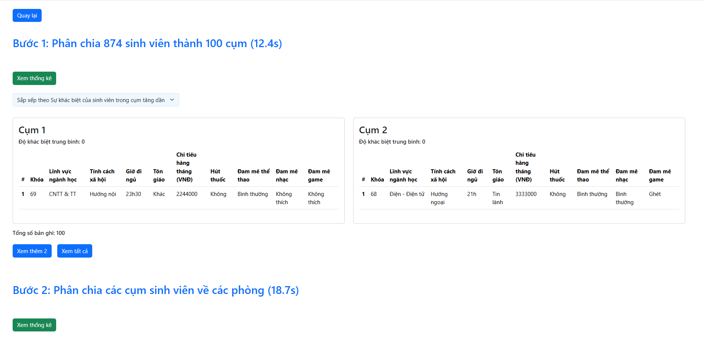

# 🚀 Room Allocator Deployment with CI/CD and Helm Chart

This repository demonstrates the deployment of the **Room Allocator** application, a Decision Support System (DSS) designed to assist dormitory management in efficiently allocating rooms, using modern DevOps practices including containerization, CI/CD pipelines, Kubernetes, and Helm.

---

## 🌐 CI/CD Workflow for Kubernetes Deployment

This repository leverages a comprehensive CI/CD workflow for deploying the **Room Allocator** application to a Kubernetes cluster. The diagram below illustrates the CI/CD pipeline:

### 🔄 Workflow Description:
1. **📝 Source Code**:
   - The source code for the frontend, backend resides in a GitHub repository.
   - Changes are committed and pushed to trigger the pipeline.
   

2. **⚙️ GitHub Actions (CI)**:
   - On every push to the main branch, GitHub Actions build Docker images for the frontend and backend.
   - The images are pushed to **DockerHub**.
   
   

3. **🐳 DockerHub**:
   - Acts as the image registry for storing Docker images used in Kubernetes deployments.
   

4. **📦 Helm Chart**:
   - A Helm chart for the Room Allocator application resides in another GitHub repository to manage Kubernetes resources.
   

5. **☸️ Kubernetes Deployment**:
   - **Argo CD** synchronizes the Helm chart from the repository and deploys the application to the Kubernetes cluster.
   

---

## 🏠 Room Allocator Helm Chart

This repository includes a Helm chart for deploying the Room Allocator application, which consists of:
- **🖥️ Frontend**: A user-friendly web interface for supporting to allocate dormitory rooms for students.
- **⚙️ Backend**: The core logic that implements decision-making algorithms and interacts with the database.
- **📊 PostgreSQL**: A database subchart to manage persistent data storage.

### ✨ Features:
### ✨ Features:
- **📦 Containerization**:
  - Frontend and backend are containerized using Docker.
  - The PostgreSQL database is deployed as a subchart for easy integration.

- **📈 Scalability**:
  - Replica counts for frontend and backend services can be configured to handle varying loads.

- **☸️ Kubernetes Native Deployment**:
  - Helm charts streamline the deployment of Room Allocator in Kubernetes.
  - Resource limits, service types, and storage configurations are easily adjustable.

- **🔄 Argo CD Integration**:
  - Supports GitOps-based continuous delivery for seamless updates and version control.

- **🤝 Decision Support**:
  - Provides tools and analytics to help dormitory managers allocate rooms effectively.

---

## 📖 Usage Instructions

### Prerequisites:
- ☸️ A Kubernetes cluster (e.g., Minikube).
- 🐙 Argo CD installed and configured in your cluster.

### Steps:
1. **🔗 Add the Helm Chart Repository to Argo CD**:
   - Navigate to the Argo CD UI and add a new Git repository containing this Helm chart.
   - Set the repository URL to the GitHub repository hosting this Helm chart.

2. **📦 Deploy the Application with Argo CD**:
   - Create a new application in Argo CD.
   - Specify:
     - **Source**: The GitHub repository and branch containing the Helm chart.
     - **Path**: The directory where the Helm chart is located.
     - **Destination**: Kubernetes cluster and namespace for deployment.

3. **📊 Monitor Deployment**:
   - Use the Argo CD UI to monitor the deployment process.
   - Verify the application status and resource synchronization.

4. **🌐 Access the Application**:
   - If using service type LoadBalancer for frontend, access the application at exposed external IP.
   - If not using service type LoadBalancer, port forward service for frontend and backend to access.
   
   

---

## Configuration

The following table lists the configurable parameters of the Room Allocator chart and their default values:

### General Configuration
| Parameter               | Description                                  | Default                  |
|-------------------------|----------------------------------------------|--------------------------|
| `fullnameOverride`      | Override the full name of the release       | `""`                    |

### Frontend Configuration
| Parameter               | Description                                  | Default                  |
|-------------------------|----------------------------------------------|--------------------------|
| `frontend.image.repository` | Frontend Docker image repository           | `haiminh263/roomallocator-frontend` |
| `frontend.image.tag`    | Frontend Docker image tag                   | `v1.0.0`                |
| `frontend.image.pullPolicy` | Frontend Docker image pull policy         | `IfNotPresent`          |
| `frontend.replicas`     | Number of frontend replicas                 | `2`                     |
| `frontend.service.type` | Frontend service type                       | `ClusterIP`             |
| `frontend.service.port` | Frontend service port                       | `80`                    |
| `frontend.resources.requests.memory` | Frontend memory request        | `256Mi`                 |
| `frontend.resources.requests.cpu`    | Frontend CPU request           | `250m`                  |
| `frontend.resources.limits.memory`   | Frontend memory limit          | `512Mi`                 |
| `frontend.resources.limits.cpu`      | Frontend CPU limit             | `500m`                  |

### Backend Configuration
| Parameter               | Description                                  | Default                  |
|-------------------------|----------------------------------------------|--------------------------|
| `backend.image.repository` | Backend Docker image repository           | `haiminh263/roomallocator-server` |
| `backend.image.tag`     | Backend Docker image tag                   | `v1.0.0`                |
| `backend.image.pullPolicy` | Backend Docker image pull policy         | `IfNotPresent`          |
| `backend.replicas`      | Number of backend replicas                 | `2`                     |
| `backend.service.type`  | Backend service type                       | `ClusterIP`             |
| `backend.service.port`  | Backend service port                       | `5000`                  |
| `backend.resources.requests.memory` | Backend memory request        | `256Mi`                 |
| `backend.resources.requests.cpu`    | Backend CPU request           | `250m`                  |
| `backend.resources.limits.memory`   | Backend memory limit          | `512Mi`                 |
| `backend.resources.limits.cpu`      | Backend CPU limit             | `500m`                  |

### PostgreSQL Configuration
| Parameter               | Description                                  | Default                  |
|-------------------------|----------------------------------------------|--------------------------|
| `postgresql.auth.username` | PostgreSQL username                       | `postgres`              |
| `postgresql.auth.password` | PostgreSQL password                       | `postgres`              |
| `postgresql.auth.database` | PostgreSQL database name                  | `roomallocator_db`      |
| `postgresql.persistence.enabled` | Enable persistence for PostgreSQL   | `true`                  |
| `postgresql.persistence.storageClass` | Storage class for PostgreSQL    | `standard`              |
| `postgresql.persistence.size` | Storage size for PostgreSQL             | `1Gi`                   |